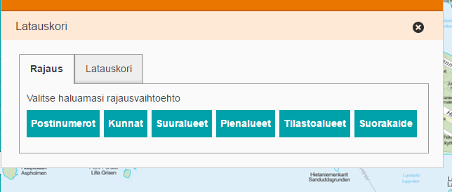

# Admin WFS Search Channel

<table class="table">
  <tr>
    <td>ID</td><td>Oskari.mapframework.bundle.downloadBasket.Bundle</td>
  </tr>
</table>

## Description

This bundle provides a new tool to download different GIS data from different interfaces (WMS/WFS). Uses oskari_maplayer table data, attributes column can have different values that
download-basket can read.
e.g.
{"forceProxy":true} -> proxies all map data to Oskari Core
{"raster":"true"} -> means that layer is e.g. geotiff or layergroup and cannot be used in download-basket
{"unique":"kokotun","forceProxy":true,"geometryColumn":"STRING","cropping":"true","geometry":"geom"} -> means that layer is a cropping layer and is used in UI

## Screenshot




## Bundle configuration

Some configuration is needed for license info:
* licenseName is used to show license name. Can be localized or only one. If licenseName is not configured and licenseUrl is configured then showed default Greative Common 4.0 lisence name.
* licenseUrl is used to show license link. Can be localized or only one.

```javascript
// Localized
"conf": {
  "licenseName": {
    "en": "Creative Common 4.0",
    "fi": "Creative Common 4.0",
    "sv": "Creative Common 4.0"
  },
  "licenseUrl": {
    "en": "http://your.license.url",
    "fi": "http://your.license.url",
    "sv": "http://your.license.url"
  }
}

// Only one
"conf": {
  "licenseName": "Creative Common 4.0",
  "licenseUrl": "http://your.license.url"
}
```

## Bundle state

No statehandling has been implemented.

## Requests the bundle handles

This bundle doesn't handle any requests.

## Requests the bundle sends out

<table class="table">
  <tr>
    <th> Request </th><th> Where/why it's used</th>
  </tr>
  <tr>
    <td>`userinterface.AddExtensionRequest`</td><td> Register as part of the UI in start()-method.</td>
  </tr>
  <tr>
    <td>`userinterface.RemoveExtensionRequest`</td><td> Unregister from the UI in stop()-method.</td>
  </tr>
</table>


## Events the bundle listens to

<table class="table">
  <tr>
    <th>Event</th><th>How does the bundle react</th>
  </tr>
  <tr>
    <td>`userinterface.ExtensionUpdatedEvent`</td>
    <td>Listens to `download-basket` Flyout opens/closes</td>
  </tr>
  <tr>
    <td>`MapClickedEvent`</td>
    <td>Listens to map click, needed when cropping area is selected from the map</td>
  </tr>
  <tr>
    <td>`AfterMapLayerAddEvent`</td>
    <td>Listens to layer add event, needed when user wants to download map data from certain map layer</td>
  </tr>
</table>

## Events the bundle sends out

This bundle doesn't send any events.

## Dependencies

<table class="table">
  <tr>
    <th>Dependency</th><th>Linked from</th><th>Purpose</th>
  </tr>
  <tr>
    <td>[jQuery](http://api.jquery.com/)</td>
    <td>Assumes to be linked in the page</td>
    <td>Used to create the component UI from begin to end</td>
  </tr>
</table>
